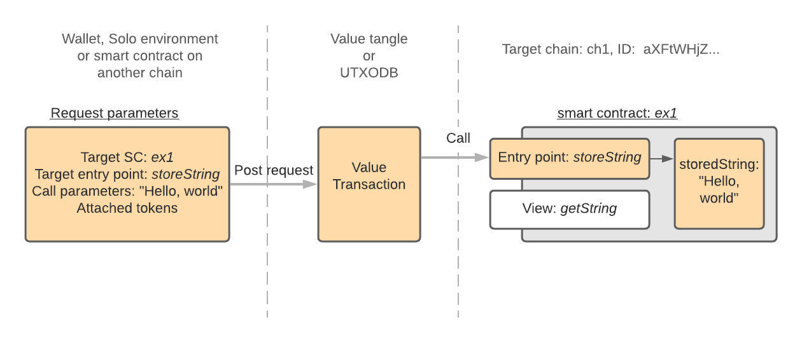

# Exploring IOTA Smart Contracts

Previous: [Deploying and running Rust smart contract](5.md#panic-exception-handling)

## Invoking smart contract. Sending a request

Sending request to a smart contract
The statements
```
req := solo.NewCall("example1", "storeString","paramString", "Hello, world!")
_, err = chain.PostRequest(req, nil)
```
in the above example `TestSolo3` invoke the `storeString` entry point of the `example1` smart contract 
by posting a request to it. 
The _Solo_ test itself is outside of the chain where smart contract is invoked, not "on-chain".
 
`NewCall` creates a call object `req` which wraps all call parameters into a single object. This is syntactic sugar 
just for convenience. In this case call object only wraps target smart contract and target entry point with one 
named parameter `paramString`. In other cases it could contain many parameters and transferred tokens. 

`PostRequest` sends the request from the Solo environment to the chain. Let’s describe in detail what is going on here.



The diagram above depicts the generic process of posting a request to the smart contract. 
It is the same for the _Solo_ environment and for any other requester which sends a request to 
the smart contract, for example ISCP wallet or another chain.
 
Posting the request always consists of steps below. 
Note that in Solo all 7 steps are carried out by one call to `PostRequest`.

1. Creating the smart contract transaction which wraps the request with 
metadata and moves tokens (the request transaction is a value transaction and always moves at least one token). 
Therefore, each request transaction must be signed by the private key of the owner of the tokens: 
the requester. It makes each requester securely identified in ISCP. 
In Solo the transaction is signed by the private key provided in the second parameter of the 
`PostRequest` call (see below);
2. Posting the request transaction to the Tangle and confirming it. 
In Solo it is adding the transaction to the `UTXODB ledger`, the emulated Value Tangle, 
so it is confirmed immediately and synchronously. 
The confirmed transaction on the ledger becomes part of the backlog of requests to the chain. 
In the real Value Tangle the sender would have to wait until the ledger confirms the transaction;
3. The chain picks the request from the backlog and runs the request on the VM;
4. The VM calls the target entry point of the smart contract program. The program updates the state;
5. The VM produces a state update transaction (anchor); 
6. Chain signs the transaction with the private key. In the Solo environment it is `ChainSigScheme` property of the chain.  
In the real Wasp environment it is threshold signature of the committee;
7. The chain posts the resulting transaction to the Tangle and confirms it. 
In the Solo environment it adds it to the UTXODB ledger. 

The following lines in the log corresponds to the step 7:
```
56:40.253	INFO	TestSolo3.ex1	vmcontext/runreq.go:177	eventlog -> '[req] [0]3U4weXHjSRzAi57hXCDp2X3ej7t8ZRtkVAWkAn2XTZLe: Ok'
56:40.254	INFO	TestSolo3.ex1	solo/run.go:75	state transition #2 --> #3. Requests in the block: 1. Posted: 0
``` 
the chain adds record about successfully processed request to the immutable on-chain log

The statement `_, err = chain.PostRequest(req, nil)` 
in the Solo test uses `nil` for the default signature scheme of the requester. 
The `OriginatorSigScheme`, the one which deployed the chain, is used as the default requester. 
In the Solo environment you can create other identities of requesters (“wallets”) with `NewSignatureSchemeWithFunds`.
   
Next: [Invoking smart contract. Calling a view](7.md)   
