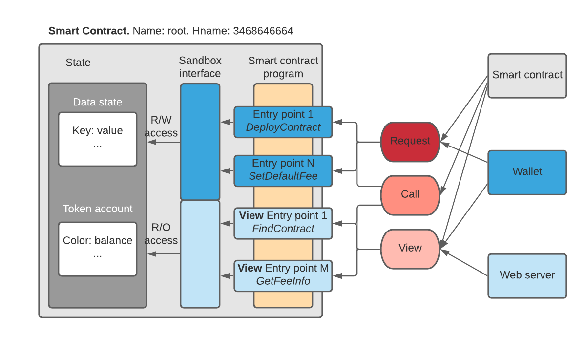

Previous: [Deploying and running Rust smart contract](chapter4.md)

## Structure of the smart contract
Smart contracts are programs immutably stored in the chain. 
In the example above the binary file with the code of the smart contract example1_bg.wasm will 
be immutably stored in the chain state.

The logical structure of an ISCP smart contract is independent of the VM type we use, 
be it a Wasm smart contract or any other. 



A smart contract on the chain is identified by its name hashed into 4 bytes and interpreted as uint32 value: 
the so called `hname`. For example, the `hname` of the root contract is _0xcebf5908_. 
It is a unique identifier of the root contract in every chain.

Each smart contract instance has a program with a collection of entry points and a state. 
An entry point is a function of the program through which the program can be invoked. 
The `example1` contract above has two entry points: `storeString` and `getString`.

There are several ways to invoke an entry point: a request, a call and a view call, 
depending on the type of the entry point.

The smart contract program can access its state and account through an interface layer called the Sandbox. 

### State
The smart contract state is its data, with each update stored on the chain. 
The state can only be modified by the smart contract program itself. There are two parts of the state:

- A collection of key/value pairs called the `data state`. 
Each key and value are byte arrays of arbitrary size (there are practical limits set by the database, of course). 
The value of the key/value pair is always retrieved by its key.
- A collection of color: balance pairs called the `account`. The account represents the balances of tokens 
of specific colors controlled by the smart contract. 
Receiving and spending tokens into/from the account means changing the account balances.
 
Only the smart contract program can change its data state and spend from its account. 
Tokens can be sent to the smart contract account by any other agent on the ledger, 
be it a wallet with an address or another smart contract. 

See [Accounts](accounts.md) for more info on sending and receiving tokens.

### Entry points
There are two types of entry points:

- _Full entry points_ or just _entry points_. These functions can modify the state of the smart contract 
(R/W access).
- _View entry points_ or _views_. These are read-only functions. 
They are used to retrieve the information from the smart contract state. 
They can’t modify the state, i.e. are read-only calls (R/O access).

The `example1` program has two entry points: 

- `storeString` a full entry point. 
It first checks if there parameter called `paramString` among parameters. 
If so, it stores the string value of the parameter into the state variable `storedString`.
If parameter `paramString` is missing, the program panics. 

- `getCounter` is a view entry point that returns the value of the variable `storedString`.

Note that `example1` the Rust function associated with the full entry point take parameters of type `ScCallContext`
which gives full access to the sandbox and allows read-write access to the state. 
In contrast, `getCounter` is a view entry point and its associated function has type `ScViewContext`, 
which allows read-only access to the state.

## Panic. Exception handler

The following test posts a request to `example1` smart contract without expected parameter `paramString`. 
The smart contract reacts to this exception by calling `panic` to the sandbox context.
```go
func TestSolo4(t *testing.T) {
	env := solo.New(t, false, false)
	chain := env.NewChain(nil, "ex1")
	// deploy the contract on chain
	err := chain.DeployWasmContract(nil, "example1", "../pkg/example1_bg.wasm")
	require.NoError(t, err)

	// call contract incorrectly
	req := solo.NewCall("example1", "storeString")
	_, err = chain.PostRequest(req, nil)
	require.Error(t, err)

}
```
The fragment in the output of the test:
```
36:53.479	PANIC	TestSolo4.ex1	vmcontext/log.go:12	string parameter not found
36:53.483	ERROR	TestSolo4.ex1	vmcontext/runreq.go:170	recovered from panic in VM: string parameter not found
36:53.483	INFO	TestSolo4.ex1	vmcontext/runreq.go:177	eventlog -> '[req] [0]H6w8hoyFx8kEAWJU5arGANqUtoB91LVma9t7oWxC64KT: recovered from panic in VM: string parameter not found'
36:53.483	INFO	TestSolo4.ex1	solo/run.go:75	state transition #3 --> #4. Requests in the block: 1. Posted: 0
``` 
It shows the panic occured indeed. Test pass because error was expected.

Note that this test ends with the state `#4`, despite the fact that last request to the smart contract failed.
This is important: whatever happens during the run of the smart contract's entry point, 
processing of **each request always results in the state transition**. 

The exceptions (panics) in the program are catched by the VM context and 
consequences of it are recorded the state of the chain during the fallback processing, no matter if the panics
was called by the logic of the smart contract or another runtime error occured. 

In the case of `example1` the error event was recorded in the immutable event log of the chain, 
but the data state of the smart contract wasn't modified.   
In other cases the fallback actions may be more complex.
   
