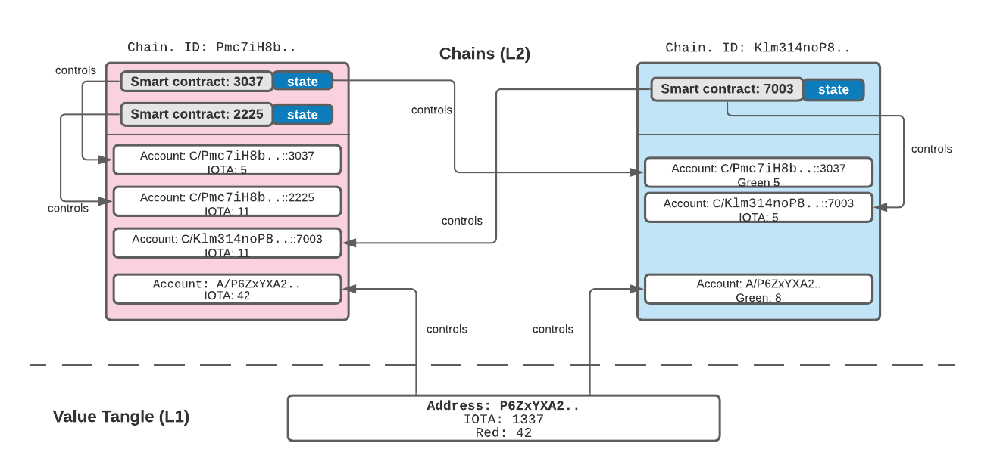

## ISCP accounts. Controlling token balances

ISCP provides secure, trustless and atomic transfers of digitized assets between smart contracts 
on the same or different chains, and between smart contracts 
and addresses on the IOTA ledger on the Value tangle.

On the Value Tangle, just like in any DLT, we have **trustless** and 
**atomic** transfers of assets between addresses of the ledger. 
The tokens contained in the address can be moved to another address by 
providing signature with the private key which controls the source address. 
(in the Solo environment it happens behinds scenes).

In ISCP, the owners of tokens are smart contracts which reside on chains. 
Each smart contract can receive tokens transferred to it and can move tokens 
controlled by it to any other owner, be it smart contract or usual address on the Value Tangle.

So, there are 2 types of entities which control tokens:
* Addresses on the IOTA ledger
* Smart contracts on ISCP chains

There are 3 different types of trustless token transfers between those entities. 
Each type involves different mechanism of transfer:
* between address and smart contract. 
* between smart contracts on the same chain
* between smart contracts on different chains

To make the system homogenous, we introduce the following two concepts:
* _Agent ID_, which represents ID of the token owner by abstracting from the type of the owning entity
* _On-chain account_ which represents unit of ownership on the chain

### Smart contract ID
Unlike in blockchain systems like Ethereum, we cannot represent the smart contract 
by an address because ISCP has many blockchains. 
Each chain is identified by its address and color and it can contain many smart contracts on it. 
So, in ISCP each contract is identified by concatenation of chain identifier, the ChainID, 
and _hname_ of the smart contract. In human readable form smart contract ID looks like this:
```
RJNmyghMeM4Yr3UtBnric8mmBBwWdt9yVifetdpCQj7J::cebf5908
```
The part before `::` is chain ID (the chain address), the part after `::` is _hname_ of the smart contract, 
the contract identifier on the chain interpreted as a hexadecimal number.

### Agent ID
The agent ID is an identifier which generalizes and represents one of the two in one identifier: 
either an address on the Value Tangle or smart contract ID. 

It is easily possible to determine which one is represented by the particular agent ID: 
is it an address or a smart contact.

In the human readable string representation, the agent ID has prefixes which indicates its types:
For an address it will be `A/`: `A/P6ZxYXA2nhmXRyUgW5Vzvju7M7m8sFCoobreWo4C8s78`

For a smart contract it will be `C/`: `C/Pmc7iH8bXj6kpb2tv5bR3d3etPLgKKqJJzUxu8FvJPmm::cebf5908` 

Address is a data type defined by Goshimmer. The _agent ID_ value contains information which one of two 
it represents: address or contract ID.

### On-chain accounts
Each chain contains any number of accounts. Each account contains colored tokens: 
a collection of `color: balance` pairs.

Each account on the chain is controlled by some `agent ID`. 
It means, tokens contained in the account can only be moved by the entity behind that agent ID:

* If the agent ID represents a tangle address, the tokens can only be moved by the request, 
sent (and signed) by that address.
* If the agent ID represents a smart contract, the tokens on the account can be 
moved only by that smart contract: independently if the smart contract resides on the same chain or on another.



The picture illustrates an example situation. 
There are two chains deployed, with respective IDs 
`Pmc7iH8b..` and `Klm314noP8..`.
 The pink chain `Pmc7iH8b..` has two smart contracts on it (`3037` and `2225`) and 
 the blue chain `Klm314noP8..` has one smart contract (`7003`).

The Value Tangle ledger has 1 address `P6ZxYXA2..`.
The address `P6ZxYXA2..` controls 1337 iotas and 42 red tokens on the Value Tangle ledger. 
The same address also controls 42 iotas on the pink chain and 8 green tokens on the blue chain. 
So, the owner of the private key behind the address controls 3 different accounts: 
1 on the L1 ledger (the Value Tangle) and 2 accounts on 2 different chains on L2. 

Same time, smart contract `7003` on the blue chain has 5 iotas on its native chain and 
controls 11 iotas on the pink chain. 

Note that “control over account” means the an entity which has the private key can move funds from it. 
For an ordinary address it means its private key. 
For a smart contract it means the private keys of the committee which runs the chain, 
because the smart contract program can only be executed with those private keys.
