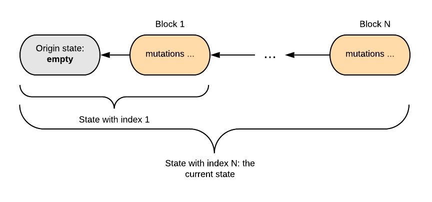
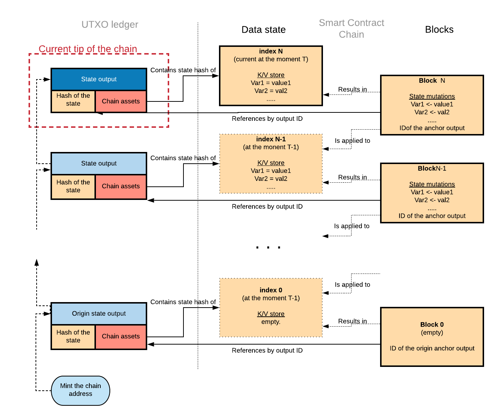

# State, transitions and state anchoring

## State of the chain

The state of the chain consists of:

- Balances of the native IOTA digital assets, colored tokens. The chain acts as a custodian for those funds
- A collection of arbitrary key/value pairs, the data state, which represents use case-specific data stored in the chain by its smart contracts outside of the UTXO ledger.

The state of the chain is an append-only (immutable) data structure maintained by the distributed consensus of its validators.

## Digital assets on the chain

The native L1 accounts of IOTA UTXO ledger are represented by addresses, each controlled by the entity holding the corresponding private/public key pair. The L1 account is a collection of UTXOs belonging to the address.

Similarly, the chain holds all tokens entrusted to it in one special UTXO, the state output (see above) which is always located in the address controlled by the chain.
It is similar to how a bank holds all deposits in its vault. This way, the chain (entity controlling the state output) becomes a custodian for the assets owned by its clients, in the same sense the bank’s client owns the money deposited in the bank.

We call the consolidated assets held in the chain “total assets on-chain”, which are contained in the state output of the chain.

## The data state

The data state of the chain consists of the collection of key/value pairs. Each key and each value are arbitrary byte arrays.

In its persistent form, the data state is stored in the key/value database outside of the UTXO ledger and maintained by the validator nodes of the chain.
The state stored in the database is called a solid state.

The virtual state is a in-memory collection of key/value pairs which can become solid upon being committed to the database. An essential property of the virtual state is the possibility to have several virtual states in parallel as candidates, with a possibility for one of them to be solidified.

The data state in any form has: a state hash, timestamp and state index.
(State hash is usually a Merkle root but it can be any hashing function of all data contained in the data state)

The data state and the on-chain assets are both contained in one atomic unit on the ledger: the state UTXO. The state hash can only be changed by the same entity which controls the funds (the committee). So, the state mutation (state transition) of the chain is an atomic event between funds and the data state.

## Anchoring the State

The data state is stored outside of the ledger, on the distributed database maintained by validators nodes.

By anchoring the state we mean: placing the hash of the data state into one special transaction and one special UTXO (an output) and adding it (confirming) on the UTXO ledger.

The UTXO ledger guarantees that at every moment there’s *exactly one* such output for each chain on the UTXO ledger. We call this output the *state output* (or state anchor) and the containing transaction *state transaction* (or anchor transaction) of the chain.

The state output is controlled (i.e. can be unlocked/consumed) by the entity running the chain.

With the anchoring mechanism the UTXO ledger supports the ISCP chain the following way:

- guarantees global consensus on the state of the chain
- makes the state immutable and tamper-proof
- makes the state consistent (see below)

The state output contains:

- Identity of the chain (alias address)
- Hash of the data state
- State index, which is incremented with each next state output, the state transition (see below)

## State Transitions

The Data state is updated by mutations of its key value pairs. Each mutation is either setting a value for a key, or deleting a key (and associeted value). Any update to the data state can be reduced to the partially ordered sequence of mutations.

The collection of mutations to the data state which is applied in a transition we call a *block*:

```
next data state = apply(current data state, block)
```

The *state transition* in the chain occurs atomically together with the movement of the chain's assets and the update of the state hash to the hash of the new data state in the transaction which consumes previous state output and produces next state output.

At any moment of time, the data state of the chain is a result of applying the historical sequence of blocks, starting from the empty data state. Hence, blockchain.



On the UTXO ledger (L1), the history of the state is represented as a sequence (chain) of UTXOs, each holding chain’s assets in a particular state and the anchoring hash of the data state. Note that not all of the state transitions history may be available: due to practical reasons the older transaction may be pruned in the snapshot process. The only thing that is guaranteed: the tip of the chain of UTXOs is always available (which includes the latest data state).

The blocks and state outputs which anchor the state are computed by the Virtual Machine (VM), a deterministic processor, a “black box”. The VM is responsible for the consistency of state transition and the state itself.


